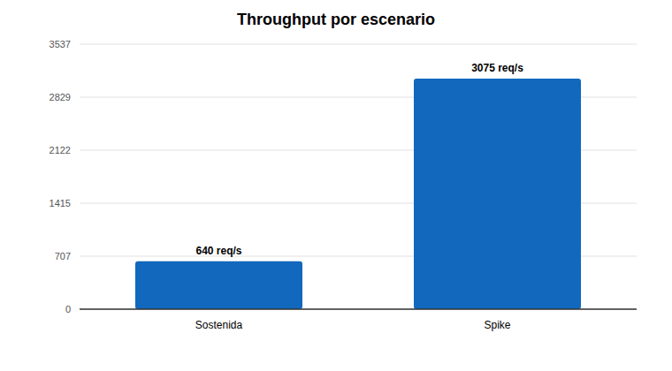
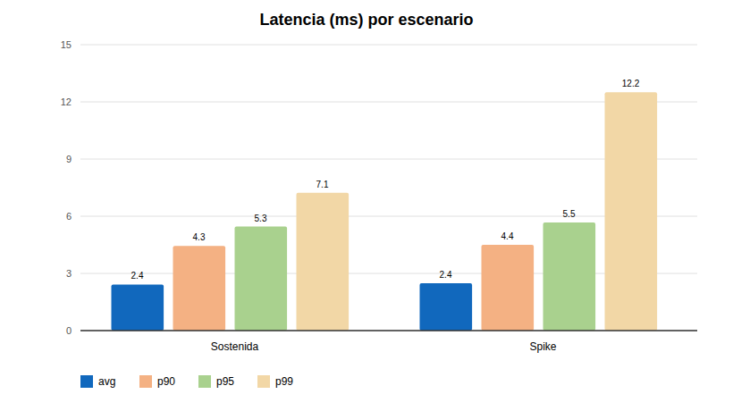
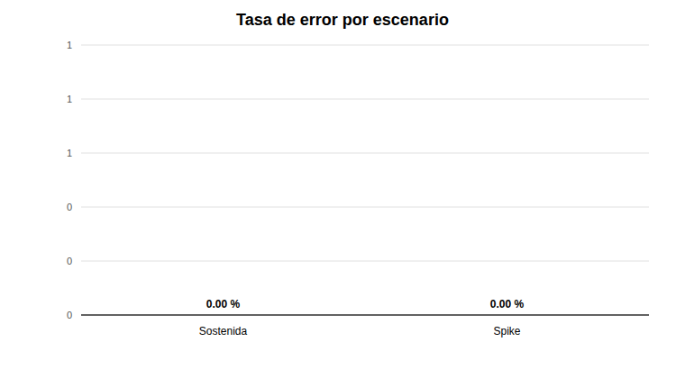
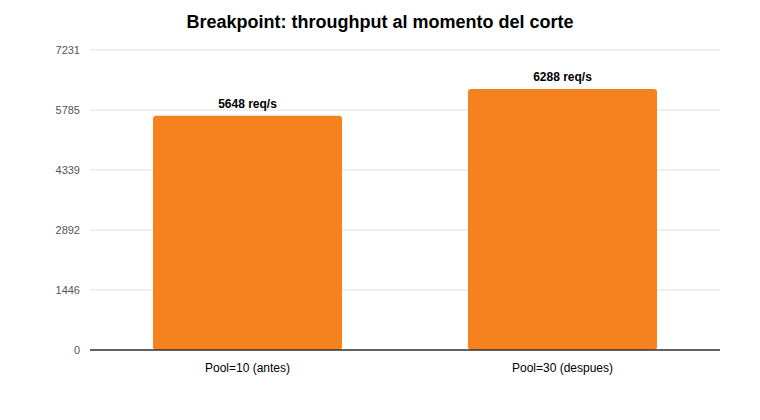
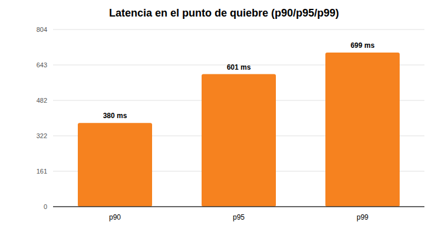

# Pruebas de carga (k6)

## Cómo correrlas: `run.sh` + un `.env` por entorno

Las mismas pruebas sirven contra el stack local, staging y producción, desde cualquier
máquina con Docker (k6 corre en el contenedor `grafana/k6`; `verify` además necesita
`python3`). El destino y la carga salen de un archivo `.env`, no del código:

```bash
cd entregas_disenio_de_apis
cp load-tests/env/staging.env.example load-tests/env/staging.env   # completa BASE_URL y credenciales
load-tests/run.sh smoke     load-tests/env/staging.env   # 1) valida conectividad, TLS y login
load-tests/run.sh sustained load-tests/env/staging.env   # 2) escenario (spike, breakpoint, dashboard-heavy)
load-tests/run.sh verify    load-tests/env/staging.env   # e2e de scripts/verify_delivery.py
```

Cada corrida imprime el destino y guarda el resumen en `load-tests/results/<env>-<escenario>-<fecha>.json`
(ignorado por git). Contra un destino que no es local, `sustained`, `spike`, `breakpoint`,
`dashboard-heavy` y `verify` piden confirmación (`ASSUME_YES=1` la omite, p. ej. en CI).

| Variable (en el `.env`) | Para qué |
|---|---|
| `BASE_URL` | **Obligatoria.** `https://api.midominio.com`, `https://<ip-ec2>` o `http://backend:8080` |
| `RUTA_ADMIN` / `RUTA_PASSWORD` | Admin del entorno (**obligatoria** la contraseña; la misma de `deploy/env/<entorno>.env` en la EC2) |
| `INSECURE_TLS` | `true` no verifica el certificado: necesario al ir directo a la EC2 con el Origin Certificate de Cloudflare |
| `LOAD_SCALE` | Multiplica VUs y tasas (`1` = perfil documentado abajo; `0.2` = 20 %). Las duraciones no cambian. Los escenarios con umbral `abortOnFail` (`breakpoint`) siguen cortando donde se crucen |
| `P95_MS` | Reemplaza el umbral de p(95) de cada escenario (útil si la latencia de red desde tu máquina es alta) |
| `USER_AGENT` | Por defecto `RutaLoadTest/1.0`: identificable en logs y en reglas de Cloudflare (el de k6 o `Python-urllib` por defecto lo pueden bloquear las reglas de bots) |
| `K6_DOCKER_NETWORK` | Solo local: red de Docker a la que unir k6 |
| `RUTA_DRIVER` / `RUTA_DRIVER_PASSWORD` | Solo `verify`: conductor del entorno (por defecto `conductor` / `conductor123`) |
| `RUTA_CHECK_FIXTURES` | Solo `verify`: `0` omite la comprobación de los datos del seed demo (59 facturas / 50 PIN); usa `0` si el entorno no se sembró con `demo/invoices.json` |

Sin comillas en los valores: `docker --env-file` no las quita.

### Contra la EC2 desde otra máquina

Dos formas de llegar, se elige con `BASE_URL`/`INSECURE_TLS`:

1. **Por el dominio (Cloudflare)** — el camino real de los usuarios: `BASE_URL=https://api.midominio.com`,
   `INSECURE_TLS=false`. Cloudflare puede desafiar o limitar mucho tráfico desde una sola IP
   (Bot Fight Mode, rate limiting), y eso contaminaría la medición: para `spike` y `breakpoint`
   crea una regla que omita esas protecciones para tu IP o usa la vía 2.
2. **Directo a la EC2** — `BASE_URL=https://<ip-o-dns-ec2>`, `INSECURE_TLS=true`. Requiere abrir
   el security group de la EC2 en 443 a la IP de la máquina de pruebas (y cerrarlo después).
   Saltarse Cloudflare también quita su capa de protección: no mides ese salto.

Recomendación: empezar por `smoke`, luego `LOAD_SCALE=0.1`–`0.2` e ir subiendo. Un perfil sin
escalar (150/750 VUs, hasta 10 000 req/s) contra una EC2 pequeña mide a la EC2, no a la app.
`verify` **escribe datos** (crea facturas `VERIFY/...` y confirma entregas) también en
producción; no borra lo que crea.

### Stack local (reproduce los resultados de abajo)

```bash
docker compose -f deploy/docker-compose.yml --env-file deploy/env/local.env up -d --build --wait
cp load-tests/env/local.env.example load-tests/env/local.env    # RUTA_PASSWORD = ADMIN_PASSWORD de deploy/env/local.env
load-tests/run.sh sustained load-tests/env/local.env
```

El backend no publica su puerto al host en el compose unificado (solo nginx lo hace, y nginx
no reenvía `/v3/api-docs` ni rutas fuera de `/api/`), así que en local k6 se une a la **red
de Docker Compose** (`K6_DOCKER_NETWORK=ruta-delivery-local_default`, que sale de
`COMPOSE_PROJECT_NAME`; con otro nombre de proyecto, ajustar). Los comandos `docker run`
de los resultados de abajo son equivalentes a `run.sh` con ese `.env`.

Todos los escenarios (`sustained.js`, `spike.js`, `breakpoint.js`, `dashboard-heavy.js`)
declaran `summaryTrendStats: ['avg', 'min', 'med', 'max', 'p(90)', 'p(95)', 'p(99)']`, así
que tanto el resumen de consola como el `--summary-export` incluyen **p99** (antes solo se
reportaba hasta p95).

## Resultados locales (2026-09-27, `deploy/docker-compose.yml`, stack local, `DB_POOL_MAX_SIZE=10`)

### Carga sostenida (Load/Stress Testing)

0→150 VUs en 3 min, meseta de 150 VUs por 7 min, bajada a 0 en 2 min (dentro del rango
mínimo exigido: 100-200 VUs, ramp-up 2-3 min, meseta 5-10 min, ramp-down 1-2 min).

```bash
docker run --rm -i --network ruta-delivery-local_default -v "$PWD":/scripts \
  -e BASE_URL=http://backend:8080 -e RUTA_PASSWORD=<...> \
  grafana/k6 run --summary-export=/scripts/local/results-sustained.json /scripts/sustained.js
```

| Indicador | Resultado | Umbral | Cumple |
|---|---:|---:|---|
| Throughput | 639,5 req/s (511 381 peticiones) | — | — |
| Latencia promedio | 2,36 ms | — | — |
| p90 | 4,33 ms | — | — |
| p95 | 5,32 ms | < 500 ms | ✅ |
| **p99** | **7,05 ms** | — | — |
| Tasa de error | 0,00 % | < 1 % | ✅ |




### Pico extremo (Spike Testing)

0→750 VUs (10x la meseta sostenida) en 30s, meseta de 1 min, bajada a 0 en 30s (dentro del
rango mínimo exigido: 5-10x la carga normal, pico de 1-2 min).

```bash
docker run --rm -i --network ruta-delivery-local_default -v "$PWD":/scripts \
  -e BASE_URL=http://backend:8080 -e RUTA_PASSWORD=<...> \
  grafana/k6 run --summary-export=/scripts/local/results-spike.json /scripts/spike.js
```

| Indicador | Resultado | Umbral | Cumple |
|---|---:|---:|---|
| Throughput | 3 075,4 req/s (403 397 peticiones) | — | — |
| Latencia promedio | 2,42 ms | — | — |
| p90 | 4,39 ms | — | — |
| p95 | 5,54 ms | < 1000 ms | ✅ |
| **p99** | **12,19 ms** | — | — |
| Tasa de error | 0,00 % | — | ✅ |
| Estado del Circuit Breaker tras el spike | `CLOSED`, 0 llamadas rechazadas | — | Sin señal de saturación |



### Punto de ruptura (Breakpoint)

A diferencia de `sustained.js`/`spike.js` (que no se degradan ni con 750 VUs),
`breakpoint.js` sube la tasa de llegada sin techo (`ramping-arrival-rate`, 500→10 000
req/s objetivo) sobre la misma mezcla de endpoints, con `abortOnFail` en los umbrales de
error y de `p(95)<500ms`: en cuanto se cruza, k6 corta la prueba ahí mismo — ese es el
breakpoint real, no un número elegido a mano.

```bash
docker run --rm -i --network ruta-delivery-local_default -v "$PWD":/scripts \
  -e BASE_URL=http://backend:8080 -e RUTA_PASSWORD=<...> \
  grafana/k6 run --summary-export=/scripts/local/results-breakpoint-pool10.json /scripts/breakpoint.js
```

| Indicador | Resultado al momento del corte |
|---|---:|
| Throughput | 4 548,9 req/s |
| VUs activas | 1 311 (tope alcanzado en la etapa de 1500 iter/s) |
| p90 | 380,2 ms |
| **p95** | **601,4 ms (cruza el umbral de 500 ms)** |
| **p99** | **699,2 ms** |
| Tasa de error | 0,00 % (el sistema se degrada en latencia, no cae) |




**Lectura:** el sistema nunca devuelve errores bajo esta mezcla de tráfico; lo que ocurre
al superar ~4 500 req/s es que la latencia se degrada exponencialmente (p95 pasa de
single-digit ms a >600 ms) hasta cruzar el umbral. `local/results-breakpoint-pool10.json` es la
salida cruda de esta corrida.

### Nota histórica: efecto del pool de HikariCP (`local/results-breakpoint-before.json`/`-after.json`)

Una ronda anterior (2026-09-26) comparó el breakpoint con `DB_POOL_MAX_SIZE=10` (valor por
defecto) contra `DB_POOL_MAX_SIZE=30`, en otra máquina y sin p99 configurado (por eso esos
dos archivos no traen `p(99)` en sus métricas — quedan como lo que son, evidencia de esa
ronda, no repetida aquí):

| Indicador | Antes (pool=10) | Después (pool=30) |
|---|---:|---:|
| Throughput al corte | 5 658 req/s | 6 301 req/s (+11 %) |
| p95 al corte | 503 ms | 509 ms |
| Tasa de error | 0,00 % | 0,00 % |

Subir el pool movió el techo ~11-16 % más allá antes de degradarse; el resto del límite en
esa máquina era CPU del contenedor del backend, no la base de datos. Los tokens JWT que
esos dos JSON guardaban en `setup_data` se redactaron por higiene (no aportan al análisis
de rendimiento). El número exacto de corte varía con la máquina donde se corre — lo
importante y estable es el orden de magnitud (varios miles de req/s) y que el sistema se
degrada en latencia, nunca en errores.

## Gráficas

Las de este stack local están en `local/graficas/` (SVG generado desde los
`local/results-*.json`, convertido a PNG para verlo sin abrir el archivo):
`throughput.png`, `latencia.png`, `error_rate.png`, `breakpoint_throughput.png`,
`breakpoint_p95.png`, `breakpoint_latencia.png`.

## Qué no se prueba y por qué

`POST /api/v1/driver/deliveries/confirm` no está incluido: cada factura solo se puede
confirmar una vez (regla real del dominio, no una limitación de la prueba), así que no hay
forma de repetirlo miles de veces sin generar una factura nueva por cada llamada. Se
prueban en cambio los endpoints de lectura, que reciben la mayor parte del tráfico real.

`dashboard-heavy.js` (tablero administrativo bajo un dataset de 500 entregas confirmadas
con foto real de ~200KB, ver `docs/EVALUACION_TECNICA.md` §9 para el hallazgo histórico
p95 21,91s→13,33ms) ya tiene `summaryTrendStats` con p99 agregado, pero no se volvió a
correr en esta ronda: no es uno de los escenarios mínimos que exige el enunciado (que pide
sostenida + spike), y requiere sembrar el dataset pesado de nuevo
(`scripts/generate_invoices.py` + `scripts/seed_confirmed_deliveries.py`) antes de medir.
